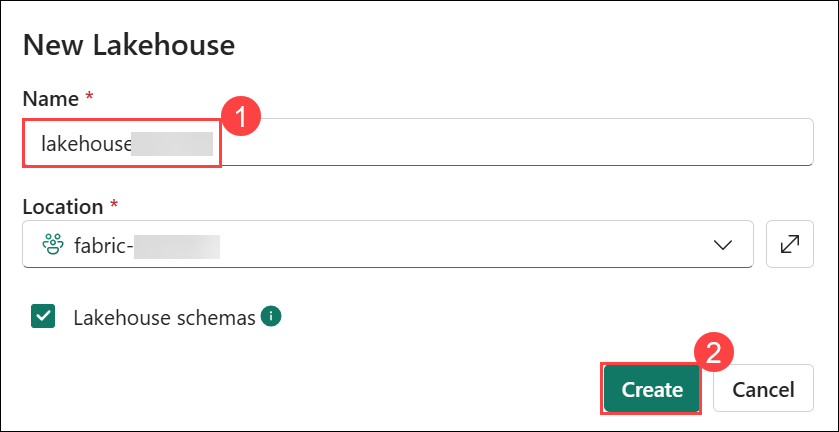
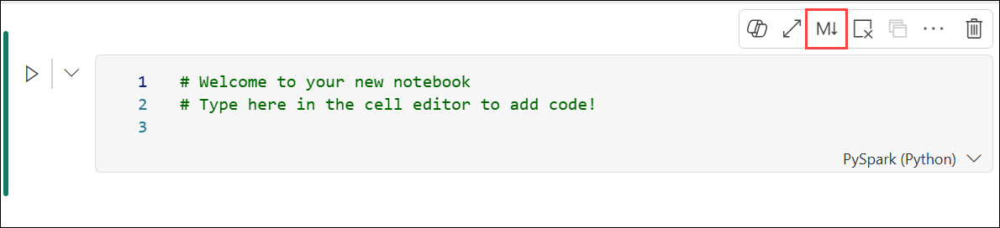
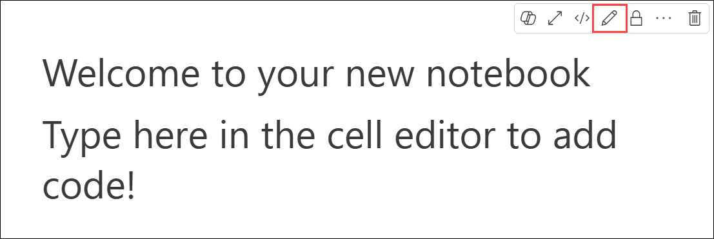
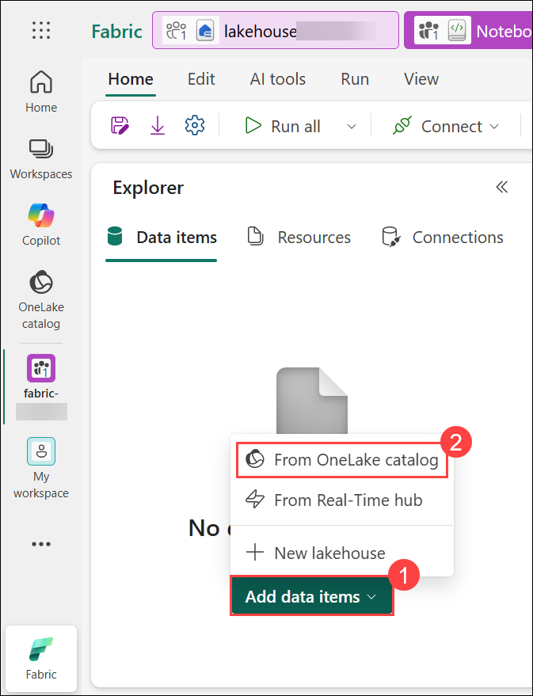
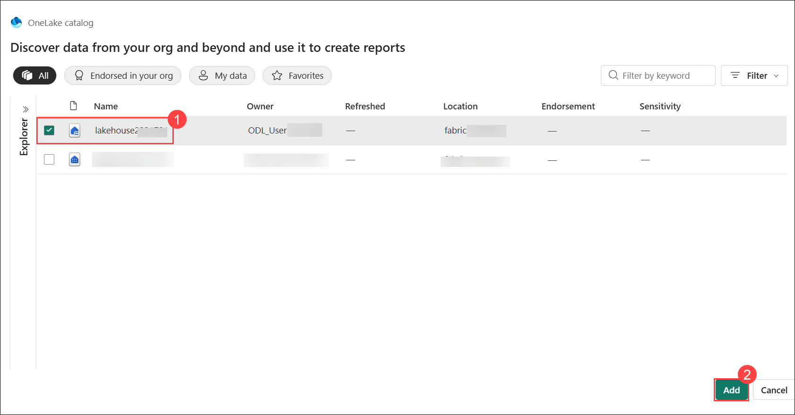
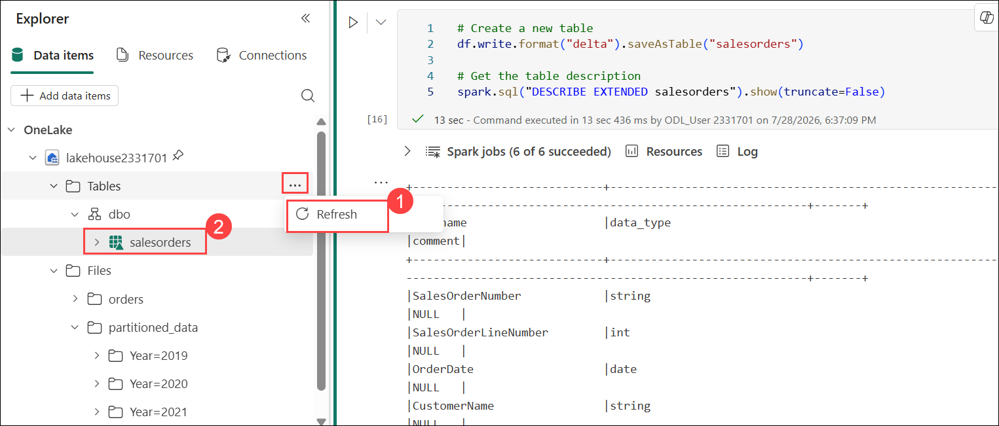

# Lab 01 : Analyze data with Apache Spark in Fabric

### Estimated Duration: 45 minutes

In this lab, you will use Apache Spark within Microsoft Fabric to ingest, process, and analyze data using PySpark. You'll begin by creating a lakehouse to store raw data files and then use notebooks to write and run Spark code for data exploration, transformation, and analysis. You'll learn how to work with DataFrames, apply filtering and grouping operations, use Spark SQL for querying data, and visualize results using built-in tools and Python libraries like matplotlib and seaborn. This end-to-end lab provides a practical introduction to scalable data analytics in Microsoft Fabric.

## Lab Objectives

In this lab, you will be able to complete the following tasks:

- Task 1: Create a lakehouse and upload files
- Task 2: Create a notebook
- Task 3: Create a Dataframe
- Task 4: Explore data in a dataframe
- Task 5: Aggregate and group data in a dataframe
- Task 6: Use Spark to transform data files
- Task 7: Work with tables and SQL
- Task 8: Visualize data with Spark

## Task 1: Create a lakehouse and upload files

In this task, you will create a lakehouse to organize and analyze your data files. After setting up your workspace, you'll switch to the *Data Engineering* experience in the portal to initiate the creation of the data lakehouse.

1. Return to your workspace. 

1. Click the **+ New item (1)** icon. On the **New item** page, scroll down to the **Store data** section and select **Lakehouse (2)**.  

     

1. Provide the following details to create a **Lakehouse**, leave the Lakehouse schemas checkbox selected and then click on **Create (2)** to proceed.

   - **Name:** Enter **lakehouse<inject key="DeploymentID" enableCopy="false"/> (1)**  

     

1. Once inside the **Lakehouse**, navigate to the **Files** folder in the **Explorer** pane. Click the **ellipses (1)** menu, select **Upload (2)**, and then choose **Upload folder (3)**.  

     

1. Click on the **Folder (1)** icon, navigate to `C:\LabFiles\files` **(2)**, select **Orders (3)** folder and then select **Upload (4)**.  

   

1. Click on **Upload**.

   

1. Click on **Upload** again.

   

1. Close the Upload file page.

   

1. After the upload is complete, expand the **Files** section, select the **orders (1)** folder, and verify that the **CSV files (2)** have been successfully uploaded, as shown below:  

     

## Task 2: Create a notebook

In this task, you will create a notebook to work with data in Apache Spark. Notebooks provide an interactive environment where you can write and run code in multiple languages, while also allowing you to add notes for documentation.

1. Select your workspace **fabric-<inject key="DeploymentID" enableCopy="false"/> (1)** from the left bar and then click **fabric-<inject key="DeploymentID" enableCopy="false"/> (2)** again.

   

1. Then select **+ New item (1)**, search for **Notebook (2)** and **Notebook (3)**.

   

1. On the menu to change the name to **Notebook<inject key="DeploymentID" enableCopy="false"/> (1)** and then **Create (2)**.

   

   > **Note:** If the **Notebook Copilot Updates and Git Integration** dialog appears, select **Skip for now** to continue.

1. Select the first cell (which is currently a code cell), and then in the top-right tool bar, use the **M↓** button to convert it to a markdown cell. The text contained in the cell will then be displayed as formatted text.

   

1. Use the 🖉 (Edit) button to switch the cell to editing mode.   

   

1. Then modify the markdown as shown below.

    ```markdown
   # Sales order data exploration
   Use this notebook to explore sales order data
    ```

    

1. When you have finished, click anywhere in the notebook outside of the cell to stop editing it and see the rendered markdown.

## Task 3: Create a DataFrame

In this task, you will create a DataFrame using PySpark to begin working with your uploaded data. DataFrames are a fundamental data structure in Spark, allowing you to efficiently load, process, and analyze large datasets in a distributed environment.

>**NOTE:** Fabric notebooks support multiple programming languages including Scala, R, and Spark SQL.

1. In the **Explorer** pane, select **Add data items (1)**, and then select **From OneLake catalog (2)**.

   

1. Select **Lakehouse<inject key="DeploymentID" enableCopy="false"/> (1)** and then click on **Add (2)**.

   

1. To load the dataset, first expand your **Lakehouse (1)**, then expand the **Files (2)** section and navigate to the **Orders (3)** folder. Locate the 2019.csv file, click the ellipsis **(⋯) (4)** next to it, and select **Load data (5)** > **Spark (6)** from the menu. This action will automatically open a new notebook with a pre-generated Spark code cell to load the data.

   

    ```python
    df = spark.read.format("csv").option("header","true").load("Files/orders/2019.csv")
    # df now is a Spark DataFrame containing CSV data from "Files/orders/2019.csv".
    display(df)
    ```

     >**Note**: You can hide the Lakehouse explorer panes on the left by using the « icons. This gives more space for the notebook.

1. Select ▷ **Run cell (1)** to the left of the cell to run the code.

   >**Note**: The first time you run Spark code, a Spark session is started. This can take a few seconds or longer. Subsequent runs within the same session will be quicker.

1. When the cell code has completed, review the **output (2)** below the cell, which should look like this:
 
    

1. The output shows data from the 2019.csv file displayed in columns and rows.  Notice that the column headers contain the first line of the data. To correct this, you need to modify the first line of the code as follows:

    ```python
    df = spark.read.format("csv").option("header","false").load("Files/orders/2019.csv")
    ```

1. Run the code again, so that the DataFrame correctly identifies the first row as data. Notice that the column names have now changed to `_c0, _c1`, etc.

    

1. Descriptive column names help you make sense of data. To create meaningful column names, you need to define the schema and data types. You also need to import a standard set of Spark SQL types to define the data types. Replace the existing code with the following:

    ```python
    from pyspark.sql.types import *

    orderSchema = StructType([
        StructField("SalesOrderNumber", StringType()),
        StructField("SalesOrderLineNumber", IntegerType()),
        StructField("OrderDate", DateType()),
        StructField("CustomerName", StringType()),
        StructField("Email", StringType()),
        StructField("Item", StringType()),
        StructField("Quantity", IntegerType()),
        StructField("UnitPrice", FloatType()),
        StructField("Tax", FloatType())
    ])

    df = spark.read.format("csv").schema(orderSchema).load("Files/orders/2019.csv")

    display(df)
    ```
    
1. Run the cell and review the output:

    

1. This DataFrame includes only the data from the 2019.csv file. Modify the code so that the file path uses a * wildcard to read all the files in the orders folder:

    ```python
    from pyspark.sql.types import *

    orderSchema = StructType([
        StructField("SalesOrderNumber", StringType()),
        StructField("SalesOrderLineNumber", IntegerType()),
        StructField("OrderDate", DateType()),
        StructField("CustomerName", StringType()),
        StructField("Email", StringType()),
        StructField("Item", StringType()),
        StructField("Quantity", IntegerType()),
        StructField("UnitPrice", FloatType()),
        StructField("Tax", FloatType())
        ])

    df = spark.read.format("csv").schema(orderSchema).load("Files/orders/*.csv")

    display(df)
    ```

1. When you run the modified code, you should see sales for 2019, 2020, and 2021. Only a subset of the rows is displayed, so you may not see rows for every year.

    >**Note**: You can hide or show the output of a cell by selecting **…** next to the result. This makes it easier to work in a notebook.

## Task 4: Explore data in a DataFrame

In this task, you will explore the contents of a DataFrame using PySpark. The DataFrame object provides powerful functionality, allowing you to filter, group, and manipulate data to better understand its structure and prepare it for analysis.

The DataFrame object provides additional functionality such as the ability to filter, group, and manipulate data.

### Filter a DataFrame

1. Add a code cell by selecting **+ Code** which appears when you hover the mouse above or below the current cell or its output.

    

1. Add the following code which filters the data so that only two columns are returned. It also uses *count* and *distinct* to summarize the number of records:

    ```python
    customers = df['CustomerName', 'Email']

    print(customers.count())
    print(customers.distinct().count())

    display(customers.distinct())
    ```
1. Run the code, and examine the output:

    * The code creates a new DataFrame called **customers** which contains a subset of columns from the original **df** DataFrame. When performing a DataFrame transformation you do not modify the original DataFrame, but return a new one.
    * Another way of achieving the same result is to use the select method:

      ```
      customers = df.select("CustomerName", "Email")
      ```
    * The DataFrame functions *count* and *distinct* are used to provide totals for the number of customers and unique customers.

1. Modify the first line of the **code (1)** by using *select* with a *where* function as follows:

    ```python
    customers = df.select("CustomerName", "Email").where(df['Item']=='Road-250 Red, 52')
    print(customers.count())
    print(customers.distinct().count())

    display(customers.distinct())
    ```

1. Then **Run (2)** the modified code to select only the customers who have purchased the Road-250 Red, 52 product. Note that you can “chain” multiple functions together so that the **output (3)** of one function becomes the input for the next. In this case, the DataFrame created by the *select* method is the source DataFrame for the **where** method that is used to apply filtering criteria.

    

## Task 5: Aggregate and group data in a DataFrame

In this task, you will learn how to aggregate and group data in a DataFrame using PySpark. By grouping records based on specific columns and applying functions like sum() and count(), you can uncover trends and summaries within your dataset, such as total sales by product or order counts by year.

1. Add a code cell, and enter the following code:

    ```python
    productSales = df.select("Item", "Quantity").groupBy("Item").sum()

    display(productSales)
    ```

2. Run the code. You can see that the results show the sum of order quantities grouped by product. The *groupBy* method groups the rows by Item, and the subsequent *sum* aggregate function is applied to the remaining numeric columns - in this case, *Quantity*.

3. Add another code cell to the notebook, and enter the following code:

    ```python
    from pyspark.sql.functions import *

    yearlySales = df.select(year(col("OrderDate")).alias("Year")).groupBy("Year").count().orderBy("Year")

    display(yearlySales)
    ```

4. Run the cell. Examine the output. The results now show the number of sales orders per year:

    * The *import* statement enables you to use the Spark SQL library.
    * The *select* method is used with a SQL year function to extract the year component of the *OrderDate* field.
    * The *alias* method is used to assign a column name to the extracted year value.
    * The *groupBy* method groups the data by the derived Year column.
    * The count of rows in each group is calculated before the *orderBy* method is used to sort the resulting DataFrame.

    

## Task 6: Use Spark to transform data files

In this task, you will use PySpark to transform data files for further analysis or processing. This includes applying operations such as selecting specific columns, renaming fields, and deriving new values—key steps in preparing data for analytics or machine learning workflows.

A common task for data engineers and data scientists is to transform data for further downstream processing or analysis.

### Use DataFrame methods and functions to transform data

1. Add a code cell to the notebook, and enter the following:

    ```python
    from pyspark.sql.functions import *

    # Create Year and Month columns
    transformed_df = df.withColumn("Year", year(col("OrderDate"))).withColumn("Month", month(col("OrderDate")))

    # Create the new FirstName and LastName fields
    transformed_df = transformed_df.withColumn("FirstName", split(col("CustomerName"), " ").getItem(0)).withColumn("LastName", split(col("CustomerName"), " ").getItem(1))

    # Filter and reorder columns
    transformed_df = transformed_df["SalesOrderNumber", "SalesOrderLineNumber", "OrderDate", "Year", "Month", "FirstName", "LastName", "Email", "Item", "Quantity", "UnitPrice", "Tax"]

    # Display the first five orders
    display(transformed_df.limit(5))
    ```

2. Run the cell. A new DataFrame is created from the original order data with the following transformations:

    - Year and Month columns added, based on the OrderDate column.
    - FirstName and LastName columns added, based on the CustomerName column.
    - The columns are filtered and reordered, and the CustomerName column removed.

3. Review the output and verify that the transformations have been made to the data.

   

You can use the Spark SQL library to transform the data by filtering rows, deriving, removing, renaming columns, and applying other data modifications.

> **TIP** : See the [Apache Spark dataframe](https://spark.apache.org/docs/latest/api/python/reference/pyspark.sql/dataframe.html) documentation to learn more about the DataFrame object.

### Save the transformed data

At this point you might want to save the transformed data so that it can be used for further analysis.

*Parquet* is a popular data storage format because it stores data efficiently and is supported by most large-scale data analytics systems. Indeed, sometimes the data transformation requirement is to convert data from one format such as CSV, to Parquet.

1. To save the transformed DataFrame in Parquet format, add a code cell and add the following code:  

    ```python
    transformed_df.write.mode("overwrite").parquet('Files/transformed_data/orders')

    print ("Transformed data saved!")
    ```

2. Run the cell and wait for the message that the data has been saved. Then, in the Lakehouses pane on the left, in the **…** menu for the **Files** node, select **Refresh**. 

    

1. Select the **transformed_data (1)** folder to verify that it contains a new folder named **orders (2)**, which in turn contains one or more Parquet files.

    

3. Add a cell with the following code:

    ```python
    orders_df = spark.read.format("parquet").load("Files/transformed_data/orders")
    display(orders_df)
    ```

4. Run the cell. A new DataFrame is created from the parquet files in the *transformed_data/orders* folder. Verify that the results show the order data that has been loaded from the parquet files.

    

### Save data in partitioned files

When dealing with large volumes of data, partitioning can significantly improve performance and make it easier to filter data.

1. Add a cell with code to save the dataframe, partitioning the data by Year and Month:

    ```python
    orders_df.write.partitionBy("Year","Month").mode("overwrite").parquet("Files/partitioned_data")

    print ("Transformed data saved!")
    ```

1. Run the cell and wait for the message that the data has been saved. Then, in the Lakehouses pane on the left, in the … menu for the Files node, select **Refresh** and expand the **partitioned_data (1)** folder to verify that it contains a hierarchy of folders named `Year=xxxx`, each containing folders named `Month=xxxx` **(2)**. Each month folder contains a parquet file with the orders for that month.

    

1. Add a new cell with the following code to load a new DataFrame from the orders.parquet file:

    ```python
    orders_2021_df = spark.read.format("parquet").load("Files/partitioned_data/Year=2021/Month=*")

    display(orders_2021_df)
    ```

1. Run the cell and verify that the results show the order data for sales in 2021. Notice that the partitioning columns specified in the path (Year and Month) are not included in the DataFrame.

    

## Task 7: Work with tables and SQL

In this task, you will learn how to create and query tables using SQL in Spark. While PySpark DataFrame methods are powerful, using SQL syntax can be more intuitive for those with a background in relational databases. You will register DataFrames as temporary views and use Spark’s metastore to define and interact with tables using standard SQL queries.

The Spark SQL library supports the use of SQL statements to query tables in the metastore. This provides the flexibility of a data lake with the structured data schema and SQL-based queries of a relational data warehouse - hence the term “data lakehouse”.

### Create a table

Tables in a Spark metastore are relational abstractions over files in the data lake. Tables can be *managed* by the metastore, or *external* and managed independently of the metastore.

1. Add a code cell to the notebook and enter the following code, which saves the DataFrame of sales order data as a table named *salesorders*:

    ```python
    # Create a new table
    df.write.format("delta").saveAsTable("salesorders")

    # Get the table description
    spark.sql("DESCRIBE EXTENDED salesorders").show(truncate=False)
    ```

    > **Note**: In this example, no explicit path is provided, so the files for the table will be managed by the metastore. Also, the table is saved in Delta format, which adds relational database capabilities to tables. This includes support for transactions, row versioning, and other useful features. Creating tables in Delta format is preferred for data lakehouses in Fabric.

1. Run the code cell and review the output, which describes the definition of the new table.

1. In the **Lakehouses** pane, in the … menu for the Tables folder, select **Refresh (1)**. Then expand the **Tables** node and verify that the **salesorders (2)** table has been created.

    

1. In the **… (1)** menu for the **salesorders** table, select **Load data (2)** > **Spark (3)**.

    

1. A new code cell is added containing code similar to the following:

    ```pyspark
    df = spark.sql("SELECT * FROM [your_lakehouse].salesorders LIMIT 1000")

    display(df)
    ```

1. Run the new code, which uses the Spark SQL library to embed a SQL query against the *salesorder* table in PySpark code and load the results of the query into a DataFrame.

### Run SQL code in a cell

While it’s useful to be able to embed SQL statements into a cell containing PySpark code, data analysts often just want to work directly in SQL.

1. Add a new code cell to the notebook, and enter the following code:

    ```SparkSQL
    %%sql
    SELECT YEAR(OrderDate) AS OrderYear,
           SUM((UnitPrice * Quantity) + Tax) AS GrossRevenue
    FROM salesorders
    GROUP BY YEAR(OrderDate)
    ORDER BY OrderYear;
    ```

1. Run the cell and review the results. Observe that:

    

    * The **%%sql** command at the beginning of the cell (called a magic) changes the language to Spark SQL instead of PySpark.
    * The SQL code references the *salesorders* table that you created previously.
    * The output from the SQL query is automatically displayed as the result under the cell.

> **NOTE:** For more information about Spark SQL and dataframes, see the [Apache Spark SQL](https://spark.apache.org/sql/) documentation.

## Task 8: Visualize data with Spark

In this task, you will visualize data from a DataFrame to identify patterns and trends more easily. While Fabric notebooks offer a basic built-in chart view, you’ll use Python libraries such as matplotlib and seaborn for greater flexibility and control in creating detailed, customized visualizations.

### View results as a chart

1. Add a new code cell, and enter the following code:

    ```python
    %%sql
    SELECT * FROM salesorders
    ```

1. Run the code to display data from the salesorders view you created previously. To change the view from **Table** to **Chart**, click on **+New chart**.

    

1. Click on the **Build my own** button at the bottom-right of the results section.

    

1. Set the chart settings as mentioned below:

    - Chart type: **Bar chart (1)**
    - X-axis: **Item (2)**
    - Y-axis: **Quantity (3)**
    - Series Group: leave blank
    - Aggregation: **Sum**
    - Missing and NULL values: **Display as 0**
    - Stacked: Unselected
    - Your chart should look similar to this **(4)**:

      

### Get started with matplotlib

1. Add a new code cell, and enter the following code:

    ```python
    sqlQuery = "SELECT CAST(YEAR(OrderDate) AS CHAR(4)) AS OrderYear, \
                    SUM((UnitPrice * Quantity) + Tax) AS GrossRevenue, \
                    COUNT(DISTINCT SalesOrderNumber) AS YearlyCounts \
                FROM salesorders \
                GROUP BY CAST(YEAR(OrderDate) AS CHAR(4)) \
                ORDER BY OrderYear"
    df_spark = spark.sql(sqlQuery)
    df_spark.show()
    ```

2. Run the code. It returns a Spark DataFrame containing the yearly revenue and number of orders. To visualize the data as a chart, we’ll first use the matplotlib Python library. This library is the core plotting library on which many others are based and provides a great deal of flexibility in creating charts.

    

3. Add a new code cell, and add the following code:

    ```python
    from matplotlib import pyplot as plt

    # matplotlib requires a Pandas dataframe, not a Spark one
    df_sales = df_spark.toPandas()

    # Create a bar plot of revenue by year
    plt.bar(x=df_sales['OrderYear'], height=df_sales['GrossRevenue'])

    # Display the plot
    plt.show()
    ```

4. Run the cell and review the results, which consist of a column chart with the total gross revenue for each year. Review the code, and notice the following:

      

    * The matplotlib library requires a Pandas DataFrame, so you need to convert the Spark DataFrame returned by the Spark SQL query.
    * At the core of the matplotlib library is the *pyplot* object. This is the foundation for most plotting functionality.
    * The default settings result in a usable chart, but there’s considerable scope to customize it.

5. Modify the code to plot the chart as follows:

    ```python
    from matplotlib import pyplot as plt

    # Clear the plot area
    plt.clf()

    # Create a bar plot of revenue by year
    plt.bar(x=df_sales['OrderYear'], height=df_sales['GrossRevenue'], color='orange')

    # Customize the chart
    plt.title('Revenue by Year')
    plt.xlabel('Year')
    plt.ylabel('Revenue')
    plt.grid(color='#95a5a6', linestyle='--', linewidth=2, axis='y', alpha=0.7)
    plt.xticks(rotation=45)

    # Show the figure
    plt.show()
    ```

6. Re-run the code cell and view the results. The chart is now easier to understand.

     

7. A plot is contained with a Figure. In the previous examples, the figure was created implicitly but it can be created explicitly. Modify the code to plot the chart as follows:

    ```python
    from matplotlib import pyplot as plt

    # Clear the plot area
    plt.clf()

    # Create a Figure
    fig = plt.figure(figsize=(8,3))

    # Create a bar plot of revenue by year
    plt.bar(x=df_sales['OrderYear'], height=df_sales['GrossRevenue'], color='orange')

    # Customize the chart
    plt.title('Revenue by Year')
    plt.xlabel('Year')
    plt.ylabel('Revenue')
    plt.grid(color='#95a5a6', linestyle='--', linewidth=2, axis='y', alpha=0.7)
    plt.xticks(rotation=45)

    # Show the figure
    plt.show()
    ```

8. Re-run the code cell and view the results. The figure determines the shape and size of the plot.
9. A figure can contain multiple subplots, each on its own axis. Modify the code to plot the chart as follows:

    ```python
    from matplotlib import pyplot as plt

    # Clear the plot area
    plt.clf()

    # Create a figure for 2 subplots (1 row, 2 columns)
    fig, ax = plt.subplots(1, 2, figsize = (10,4))

    # Create a bar plot of revenue by year on the first axis
    ax[0].bar(x=df_sales['OrderYear'], height=df_sales['GrossRevenue'], color='orange')
    ax[0].set_title('Revenue by Year')

    # Create a pie chart of yearly order counts on the second axis
    ax[1].pie(df_sales['YearlyCounts'])
    ax[1].set_title('Orders per Year')
    ax[1].legend(df_sales['OrderYear'])

    # Add a title to the Figure
    fig.suptitle('Sales Data')

    # Show the figure
    plt.show()
    ```

10. Re-run the code cell and view the results. 

     

     >**Note**: To learn more about plotting with matplotlib, see the [matplotlib](https://matplotlib.org/) documentation.

### Use the seaborn library

While *matplotlib* enables you to create different chart types, it can require some complex code to achieve the best results. For this reason, new libraries have been built on matplotlib to abstract its complexity and enhance its capabilities. One such library is seaborn.

1. Add a new code cell to the notebook, and enter the following code: 

    ```python
    import seaborn as sns

    # Clear the plot area
    plt.clf()

    # Create a bar chart
    ax = sns.barplot(x="OrderYear", y="GrossRevenue", data=df_sales)

    plt.show()
    ```

2. Run the code to display a bar chart created using the seaborn library.

     

3. Modify the code as follows:

    ```python
    import seaborn as sns

    # Clear the plot area
    plt.clf()

    # Set the visual theme for seaborn
    sns.set_theme(style="whitegrid")

    # Create a bar chart
    ax = sns.barplot(x="OrderYear", y="GrossRevenue", data=df_sales)

    plt.show()
    ```

4. Run the modified code and note that seaborn enables you to set a color theme for your plots.

     

5. Modify the code again as follows:

    ```python
    import seaborn as sns

    # Clear the plot area
    plt.clf()

    # Create a line chart
    ax = sns.lineplot(x="OrderYear", y="GrossRevenue", data=df_sales)

    plt.show()
    ```

6. Run the modified code to view the yearly revenue as a line chart.

   >**Note**: To learn more about plotting with seaborn, see the [seaborn](https://seaborn.pydata.org/index.html) documentation.

1. After completing the lab, on the notebook menu, select **Stop session** to end the Spark session.

    

### Review

In this lab, you worked through the end-to-end process of analyzing data with Apache Spark in Microsoft Fabric. You created a lakehouse, built a notebook, and used PySpark to load, explore, transform, and visualize data. You also practiced using both DataFrame methods and SQL for flexible data analysis.

In this lab, you have completed the following tasks:

- Created a lakehouse and upload files
- Created a notebook
- Created a Dataframe
- Explored data in a dataframe
- Aggregated and grouped data in a dataframe
- Used Spark to transform data files
- Worked with tables and SQL
- Visualized data with Spark

## Now, click on **Next >>** from the lower right corner to move on to the next lab.

    
