# Lab 02: Ingest data with a pipeline in Microsoft Fabric

### Estimated duration: 45 minutes

In this lab, you will learn how to ingest data into a Microsoft Fabric lakehouse using pipelines—an essential skill for building scalable cloud analytics solutions. A data lakehouse serves as a unified analytical data store, and one of a data engineer's key responsibilities is to ingest data from various operational sources into this environment. You will implement extract, transform, and load (ETL) or extract, load, and transform (ELT) processes by creating pipelines in Microsoft Fabric. Leveraging Fabric’s support for Apache Spark, you will build a workflow that copies data from external sources into OneLake storage and uses Spark to transform the data before loading it into structured tables for analysis.

## Lab Objectives

In this lab, you will be able to complete the following tasks:

- Task 1: Create a Subfolder in lakehouse
- Task 2: Create a pipeline
- Task 3: Create a notebook
- Task 4: Modify the pipeline


## Task 1: Create a Subfolder in lakehouse

In this task, you will create subfolder in the existing lakehouse.

1. On the menu bar on the left, select the **Lakehouse** created earlier.

1. On the **Explorer** pane on the left, in the **... (1)** menu for the **Files** node, select **New subfolder (2)**.

   

1. Create a subfolder named **new_data (1)** and then click on **Create (2)**.

   

## Task 2: Create a pipeline

In this task, you will create a pipeline in Microsoft Fabric to ingest data into your lakehouse. You will use the Copy Data activity to extract data from a source and copy it into a subfolder within the lakehouse, forming the foundation for an ETL or ELT process.

1. In the **fabric-<inject key="DeploymentID" enableCopy="false"/>** workspace, click on **+ New item (1)**, then in the right pane, search for **Pipeline (2)** in the search bar, and select **Pipeline (3)** under the **Get data** section.

    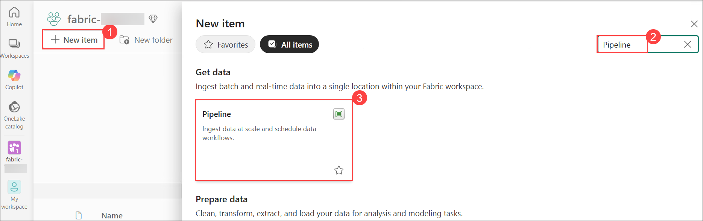

    - Create a new data copy job named **Ingest Sales Data (3)** and then **Create (4)**.

      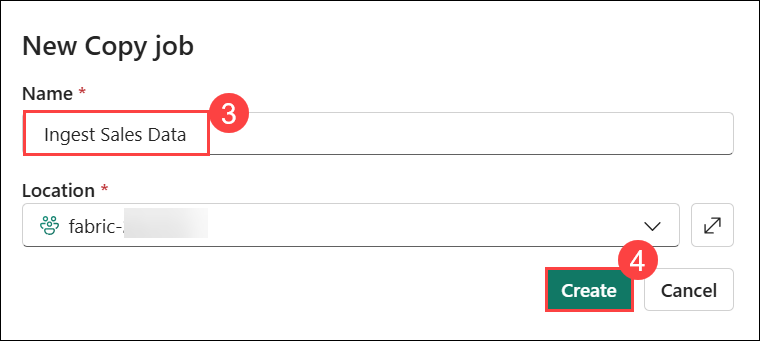

1. If the **Copy data** assistant doesn't open automatically, select **Copy data assistant** in the pipeline editor page.

    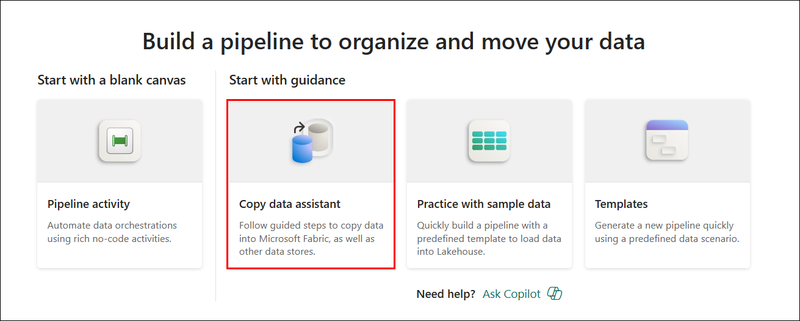

1. In the **Copy job** wizard, on the **Choose data source** page, enter **HTTP (1)** in the search bar and then select **HTTP (2)** in the **New sources** section.

    

1. In the **Connect to data source** pane, enter the following settings for the connection to your data source and then click on **Next (6)**:

    - **URL**: `https://raw.githubusercontent.com/MicrosoftLearning/dp-data/main/sales.csv` **(1)**
    - **Connection**: Create new connection **(2)**
    - **Connection name**: **Salesconnection (3)**
    - **Data gateway**: (none) **(4)**
    - **Authentication kind**: Anonymous **(5)**

      

1. Then ensure the following settings are selected and then click on **Next**:

    - **Relative URL**: *Leave blank*
    - **Request method**: GET
    - **Additional headers**: *Leave blank*
    - **Binary copy**: <u>Un</u>selected
    - **Request timeout**: *Leave blank*
    - **Max concurrent connections**: *Leave blank*

      

1. Wait for the data to be sampled and then ensure that the following settings are selected and leave all other fileds as default:

    - **File format**: DelimitedText **(1)**
    - **Column delimiter**: Comma (,) **(2)**
    - **Row delimiter**: Line feed (\n) **(3)**
    - **First row as header**: Selected
    - Click **Preview data (4)** to see a sample of the data.

      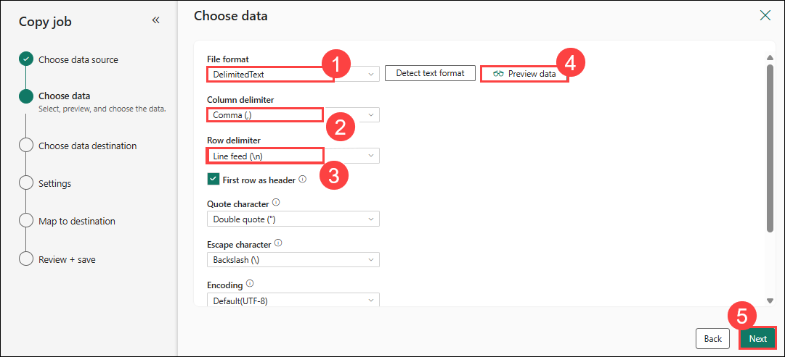    

1. Then close the data preview and select **Next (6)**.    

1. On the **Choose data destination** page, click on **OneLake catalog (1)** from the top menu bar, then select the lakehouse named **Lakehouse_<inject key="DeploymentID" enableCopy="false"/> (2)**.

    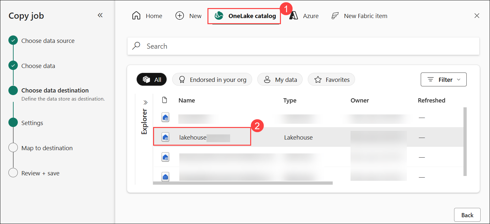  

1. On the **Map to destination** page, configure the following settings:

    - Folder path: **new_data (1)**
    - File name: **sales.csv  (2)**
    - Expand **File format settings dropdown (3)**

      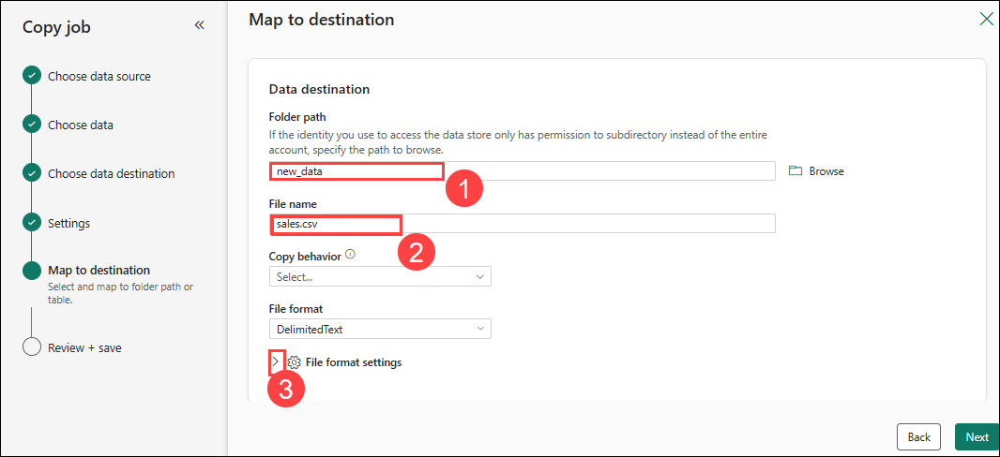  
   
1. Scroll down and select following settings from **File format settings** and then click on **Next (3)**:

    - Column delimiter: **Comma (,) (1)**
    - Row delimiter: **Line feed (\n) (2)**

      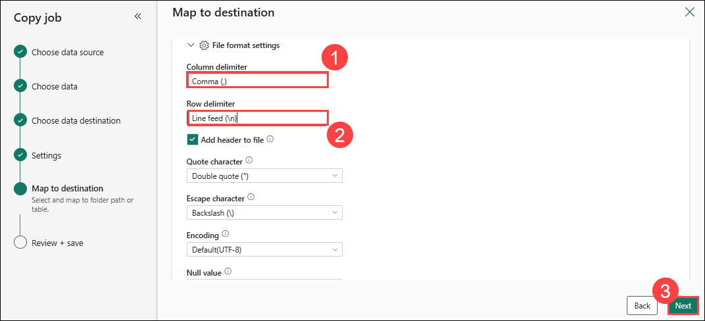  

14. On the **Review + save** page, review the copy summary to verify all source and destination settings, and then click on **Save** to initiate the data copy process.

     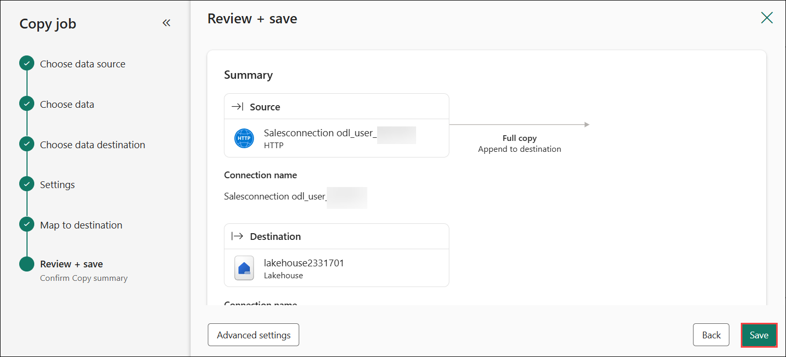  

15. After executing the copy operation, a new pipeline containing the **Copy job** activity is automatically created, as shown in the diagram.

1. Click on the **Copy job (1)**,go to **Setting (2)** tab located bottom-left  and in the **connection** drop down, select **Browse all (3)**

     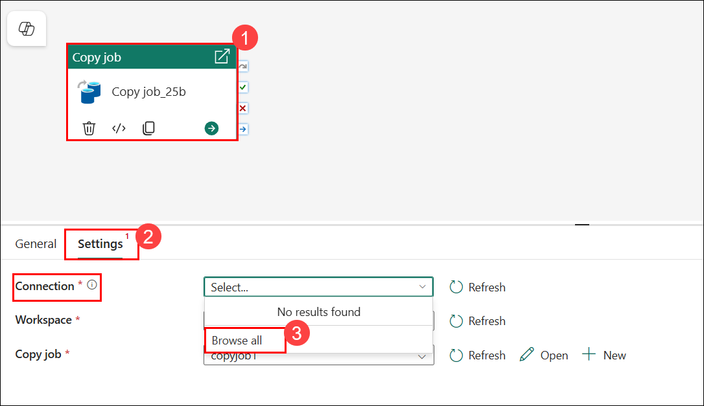  

1. On the **Choose a data source to get started** page, select **Copy job**

    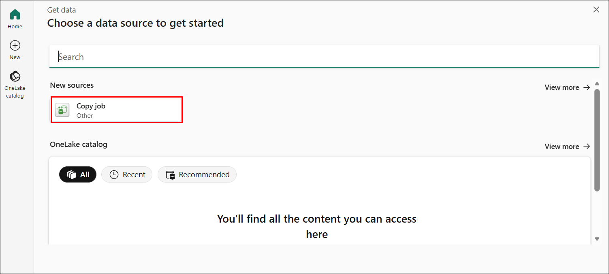  

1. On the **Connect data source** page, select **Create new connection (1)** and in the **Authentication kind**, select **Organizational account (2)** then click on **Sign in (3)**

    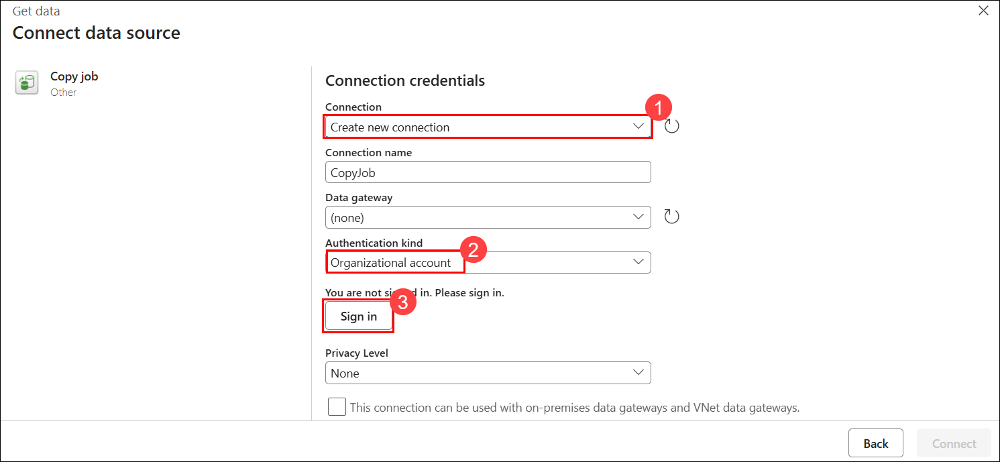  

1. In the pop-up select the provided **Email: <inject key="AzureAdUserEmail"></inject>** then click on **Connect**

    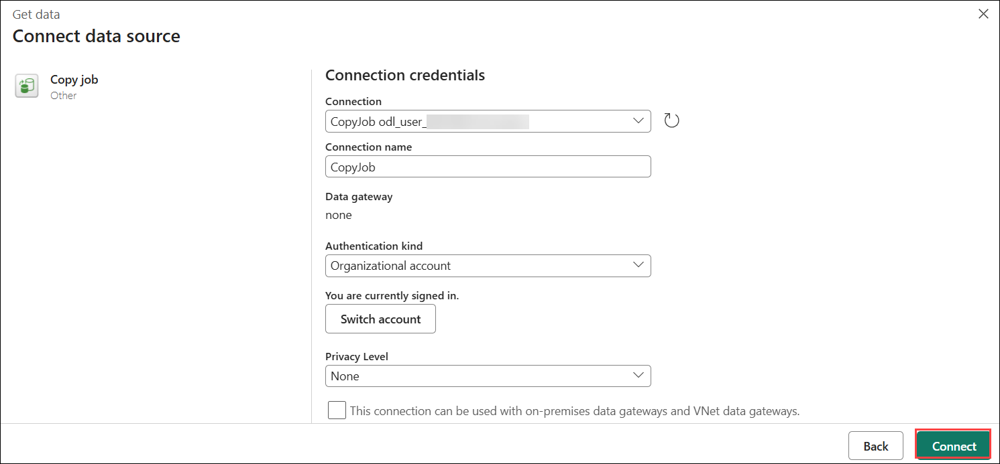  

1. Click on the **Home (1)** tab, save the pipeline using the **Save (2)** icon, then execute it by clicking **Run (3)** and wait for all activities to complete.

    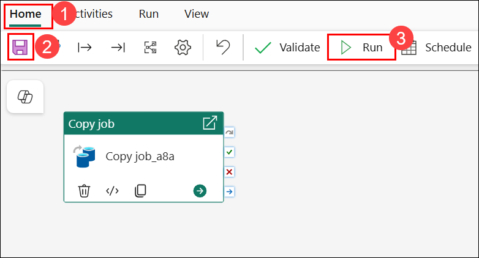 

1. Once the pipeline is running, monitor its execution status by selecting the **Output** tab below the pipeline designer. Click the refresh **↻** icon to update the status, and wait for the pipeline to show as Succeeded.

    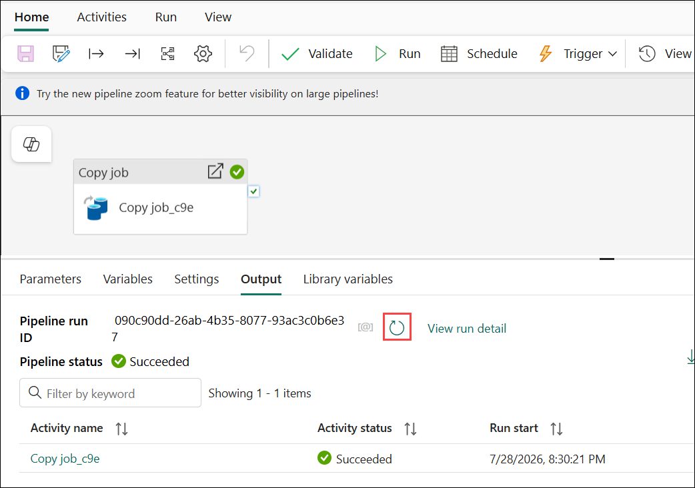 

1. Select your lakehouse **lakehouse<inject key="DeploymentID" enableCopy="false"/>** from the top menu bar.

18. In the **Explorer** pane, click the **ellipsis (...)** next to the **Files** folder, and  select **Refresh** to verify that the folder **new_data (1)** contains the copied file by selecting the new_data shows **sales.csv (2)** on right-pane.

    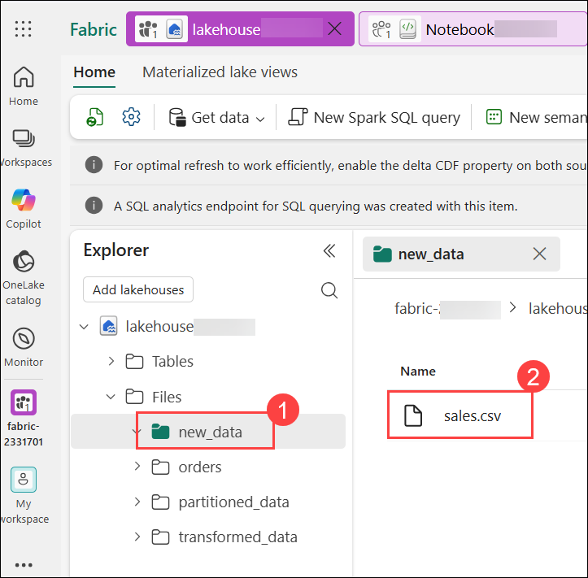 

## Task 3: Create a notebook

In this task, you will create a notebook in Microsoft Fabric to begin processing your ingested data using PySpark. You’ll write code to load sales data, apply transformations, and save the results as a table in the lakehouse—enabling further analysis or reporting through SQL or visualization tools.

1. From the lakehouse Home page, select **Analyze data with (1)** dropdown and select **Notebook (2)** option under that choose **New notebook** after it takes you to notebook page view with default notebook cell.

     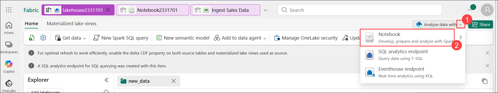 

     >**Note**: After a few seconds, a new notebook containing a single *cell* will open. Notebooks are made up of one or more cells that can contain *code* or *markdown* (formatted text).

1. Select the existing cell in the notebook, which contains some simple code, and then replace the default code with the following variable declaration.

    ```python
    table_name = "sales"
    ```

1. In the **... (1)** menu for the cell (at its top-right) select **Toggle parameter cell (2)**. This configures the cell so that the variables declared in it are treated as parameters when running the notebook from a pipeline.

    

1. Run the cell.

    

1. Under the parameters cell, use the **+ Code** button to add a new code cell. Then add the following code to it:

    ```python
   from pyspark.sql.functions import *

   # Read the new sales data
   df = spark.read.format("csv").option("header","true").load("Files/new_data/*.csv")

   ## Add month and year columns
   df = df.withColumn("Year", year(col("OrderDate"))).withColumn("Month", month(col("OrderDate")))

   # Derive FirstName and LastName columns
   df = df.withColumn("FirstName", split(col("CustomerName"), " ").getItem(0)).withColumn("LastName", split(col("CustomerName"), " ").getItem(1))

   # Filter and reorder columns
   df = df["SalesOrderNumber", "SalesOrderLineNumber", "OrderDate", "Year", "Month", "FirstName", "LastName", "EmailAddress", "Item", "Quantity", "UnitPrice", "TaxAmount"]

   # Load the data into a table
   df.write.format("delta").mode("append").saveAsTable(table_name)
    ```

    This code loads the data from the sales.csv file that was ingested by the **Copy Data** activity, applies some transformation logic, and saves the transformed data as a table - appending the data if the table already exists.

1. Verify that your notebooks looks similar to this, and then use the **&#9655; Run all** button on the toolbar to run all of the cells it contains.

    

    > **Note**: Since this is the first time you've run any Spark code in this session, the Spark pool must be started. This means that the first cell can take a minute or so to complete.

1. When the notebook run has completed, in the **Lakehouse explorer** pane on the left, in the **...** menu for **Tables** select **Refresh** and verify that a **sales** table has been created.

    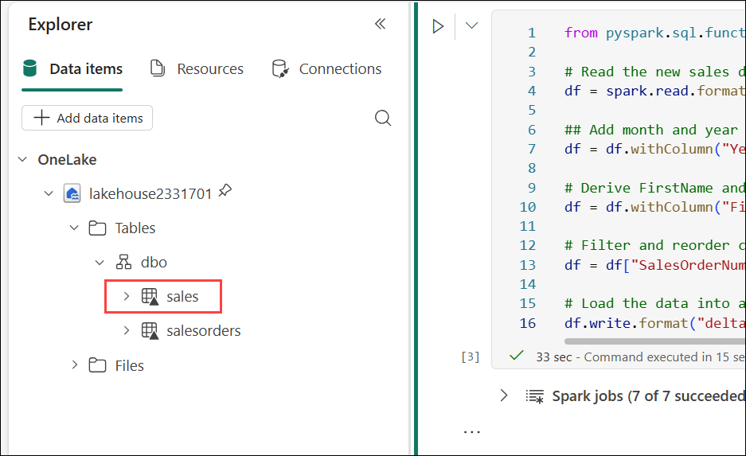

1. In the notebook menu bar, use the ⚙️ **Settings (1)** icon to view the notebook settings.

1. Then set the **Name** of the notebook to **Load Sales (2)** and close the settings pane **(3)**.

    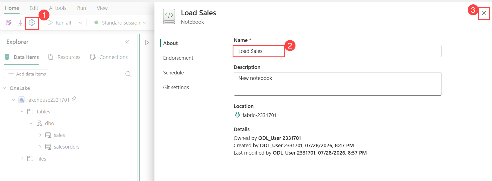

1. In the hub menu bar on the top, select your lakehouse **lakehouse<inject key="DeploymentID" enableCopy="false"/>**.

1. In the **Explorer** pane, refresh the view. Then expand **Tables (1)**, and select the **sales (2)** table to see a preview of the data it contains **(3)**.

    

## Task 4: Modify the pipeline

In this task, you will modify your existing pipeline to include the notebook you created for data transformation. By integrating the notebook into the pipeline, you’ll build a reusable and automated ETL process that extracts data, runs Spark-based transformations, and loads the results into a lakehouse table.

1. In the hub menu bar on the left select the **Ingest Sales Data** copy job you created previously.

    

2. From the **Activities (1)** tab, click the **ellipsis (...) (2)** in the toolbar, select **Delete data (3)** from the list, then position the **Delete data** activity to the left of the **Copy job** activity and connect the **On completion** (blue arrow) output from **Delete data** to **Copy job**, as shown below:

    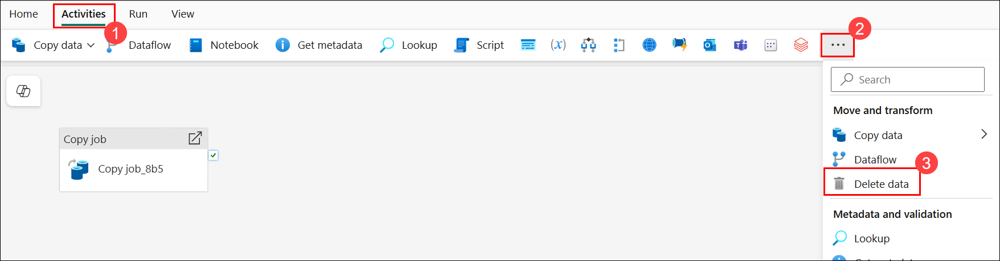

    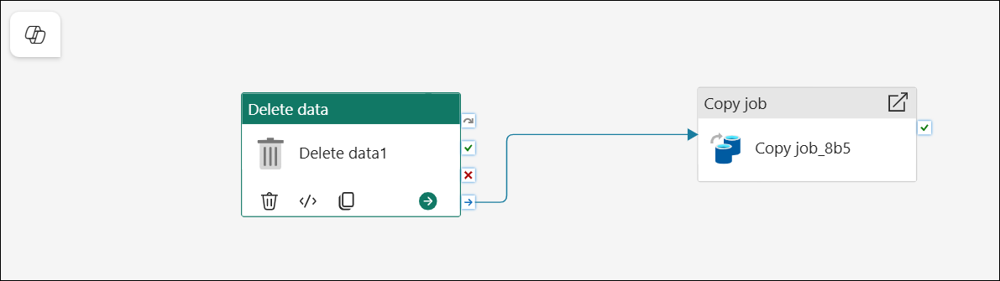

3. Select the **Delete data (1)** activity. In the pane below the design canvas, set the following properties:

    - Select the **General (2)** tab:
        - In **Name**: Add **Delete old files** **(3)**

          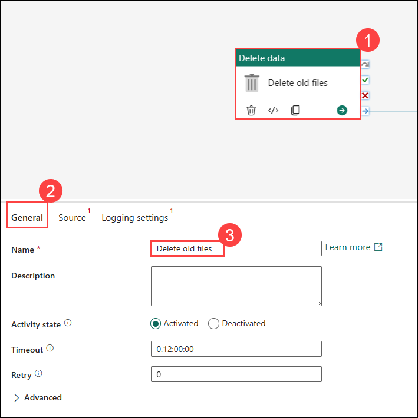
    
    - In the **Source (1)** tab, open the **Connection (2)** dropdown and select **Browse all (3)**.

         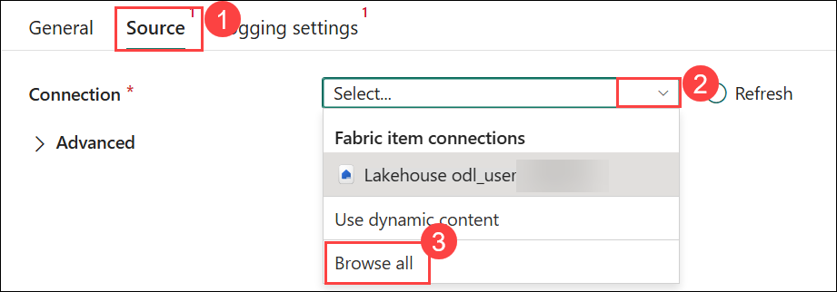
    
        - From the **Choose a data source to get started** window, select **Lakehouse_<inject key="DeploymentID" enableCopy="false"/>**.

          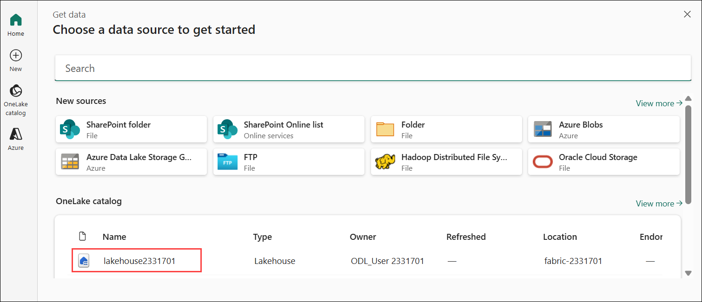

        - Once connected, configure the following:
            - **File path type**: Wildcard file path **(1)**
            - **Folder path**: new_data **(2)**
            - **Wildcard file name**: *.csv **(3)**    
            - **Recursively**: Selected **(4)**

                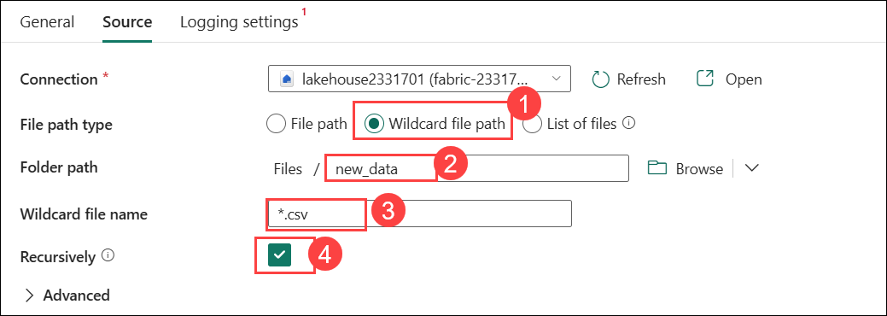

    - Click on **Logging settings (1)** tab:
        - **Enable logging**: *Unselected* **(2)**

          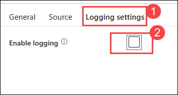

1. These settings will ensure that any existing .csv files are deleted before copying the **sales.csv** file.

1. In the pipeline designer, on the **Activities (1)** tab, select **Notebook (2)** to add a **Notebook** activity to the pipeline.

    

1. Select the **Copy data** activity and then connect its **On Completion** output to the **Notebook** activity as shown here:

    

1. Select the **Notebook (1)** activity, and then in the pane below the design canvas, set the following properties:
    - **General (2)**:
        - **Name**: Load Sales notebook **(3)**

      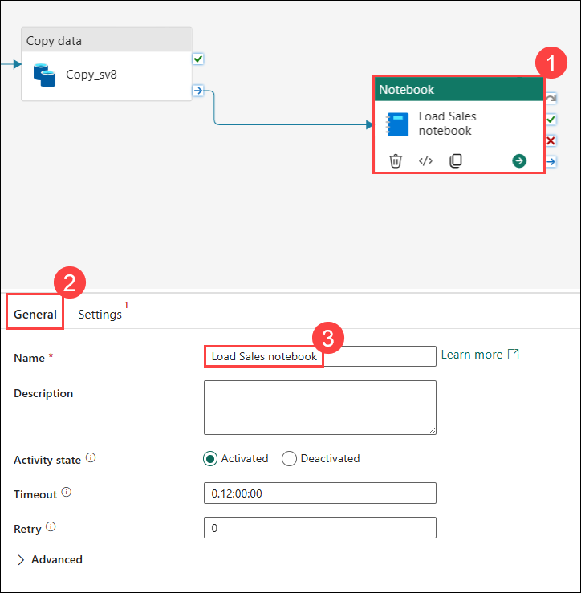

    - **Settings (1)**:
        - **Notebook**: Load Sales **(2)**
        - **Base parameters (3)**: Click on **New (4)** to add a new parameter with the following properties:
            
            | Name | Type | Value |
            | -- | -- | -- |
            | table_name **(5)** | String **(6)** | dbo.new_sales **(7)** |

            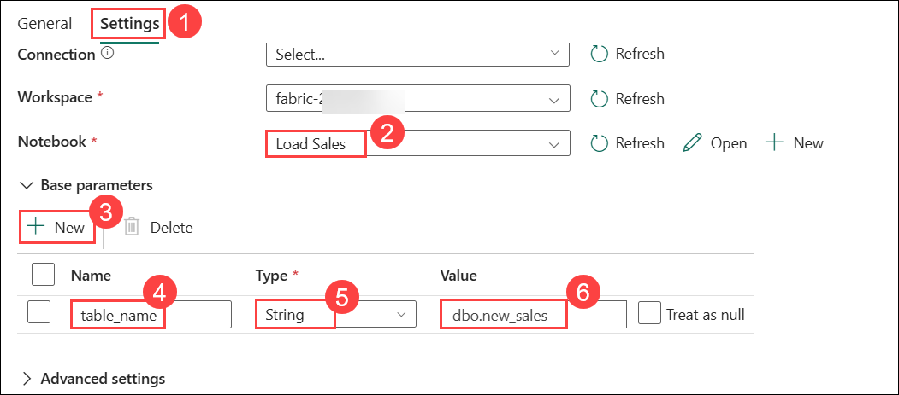            

    The **table_name** parameter will be passed to the notebook and override the default value assigned to the **table_name** variable in the parameters cell.

7. Click on the **Home (1)** tab, save the pipeline using the **Save (2)** icon, then execute it by clicking **Run (3)** and wait for all activities to complete.

     

     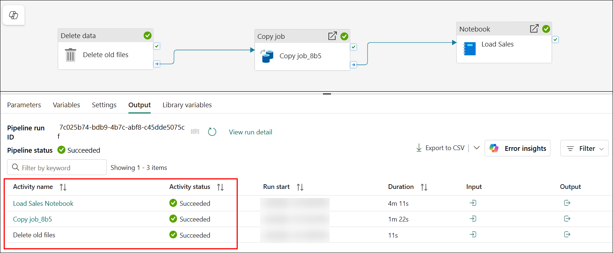

     >**Note**: In case you receive the error message *Spark SQL queries are only possible in the context of a lakehouse. Please attach a lakehouse to proceed*: Open your notebook, select the lakehouse you created on the left pane, select **Remove all Lakehouses** and then add it again. Go back to the pipeline designer and select **&#9655; Run**.

1. In the hub menu bar on the top, select your lakehouse **lakehouse<inject key="DeploymentID" enableCopy="false"/> (1)**.

1. Navigate to your **Lakehouse**. Then in the **Explorer** pane, expand **Tables (1)** then **refresh** and select the **new_sales (2)** table to see a preview of the data it contains. This table was created by the notebook when it was run by the pipeline.

    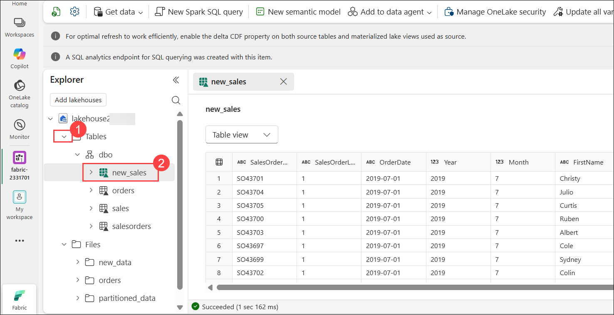

## Review    

In this lab, you implemented a data ingestion solution that uses a pipeline to copy data to your lakehouse from an external source, and then uses a Spark notebook to transform the data and load it into a table.

In this lab, you have completed the following tasks:

- Created a Subfolder in lakehouse
- Created a pipeline
- Created a notebook
- Modified the pipeline

## Now, click on **Next >>** from the lower right corner to move on to the next lab.

    
